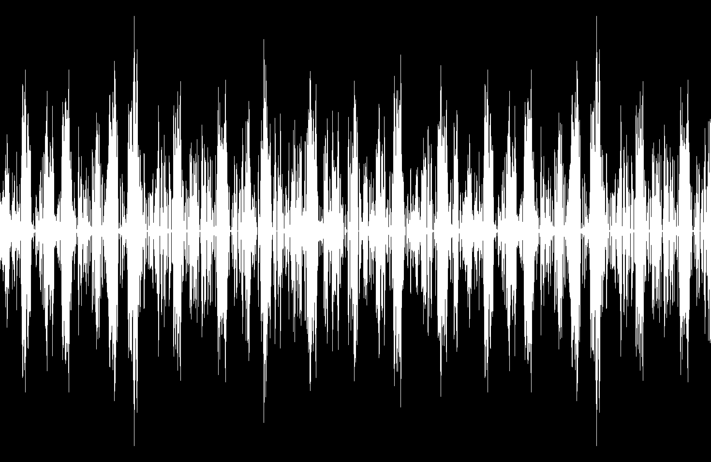

# visualizer

An audio visualizer made using SDL and OpenGL.




## Install

- Clone the repo and install dependencies

  ```bash
  git clone https://github.com/ish-u/visualizer.git
  cd visualizer
  ```

- Install SDL2 from - [SDL](https://www.libsdl.org/). For MacOS you can use [brew](https://formulae.brew.sh/formula/sdl2)

  ```bash
  brew install sdl2
  ```

- Verify SDL2 is configured correctly by running `sdl2-config --version`

- Get `glad` headers at https://gen.glad.sh/ - Make sure to select `gl: 4.1` and `Core` and add them as following in your directory

  ```
  ├── include/
  │   ├── glad/
  │   │   └── gl.h
  │   └── KHR/
  │       └── khrplatform.h
  ├── src/
  │   ├── gl.c
  └── main.c
  ```

- Run `make run` to compile and run

- Switch b/w visualzation using `Left` and `Right` arrows.

- You can use [BlackHole](https://existential.audio/blackhole/) to add loopback in MacOS to get system audio.

#### References

- [SDL](https://www.libsdl.org/)
- [GLAD](https://github.com/Dav1dde/glad)
- [OpenGl](https://www.opengl.org/)
